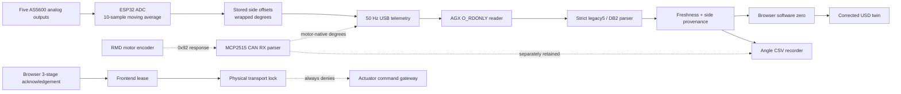

# Low-level controller observation and safety architecture

Status: source checkpoint, not a claim about firmware currently installed on
the robot.

## Runtime flow



Solid arrows are active in the host observation stack. Dashed motor-feedback
arrows are staged in source and disabled by
`MOTOR_FEEDBACK_QUERY_ALLOWED = false`. The physical gateway is absent and the
frontend endpoint returns `PHYSICAL_TRANSPORT_LOCKED` after all three clicks.

## Controller gates

| Subsystem | Source state | Success evidence | Failure behavior |
|---|---|---|---|
| External sensors | Runs independently of play mode and CAN | Five degree values at 50 Hz | Host rejects malformed, missing, stale, and out-of-range frames |
| Chirality | Must exist in SPIFFS before CAN initialization | Saved `left` or `right`; reboot follows changes | Missing or invalid chirality leaves CAN disabled |
| MCP2515 initialization | Skipped by the default build | `canReady` only after `CAN_OK` | Sensor telemetry continues after CAN initialization failure |
| Knee mapping | AS5600 drives the upstream actuator shaft 1:1 | Corrected USD closure produces downstream bend | No extra firmware or host knee multiplier |
| Motor-native feedback | Compile-time false | Six verified `0x92` responses per side in `DB2` | Each missing or stale channel emits `NA`; no AS5600 substitution |
| Legacy motion console | Compile-time false | None in this checkpoint | Motion requests are denied |
| Torque output | Observation-only guard in every sender | Requires a future reviewed gateway and source release | No CAN torque or stop frames from this build |
| Host USB | Opens leg tty paths read-only | Fresh sequence and zero transmitted bytes | Stale side remains visibly unavailable |

## Dual-angle record

`legacy5` carries five external sensor angles:

```text
outer_calf,inner_calf,hip_pitch,knee_actuator,hip_roll
```

`DB2` carries the same measurements and six independent motor angles:

```text
DB2,millis,outer_ext,inner_ext,hip_pitch_ext,knee_ext,hip_roll_ext,
outer_motor,inner_motor,hip_pitch_motor,knee_motor,hip_yaw_motor,hip_roll_motor
```

Angles are degrees. Motor values use `0.01°` RMD multi-turn units decoded as a
signed 32-bit little-endian value. A missing response is `NA`. The request
opcode and response-ID rule are grounded in the `dropbear_control` RMD V4.4
golden vectors, but applicability to the installed actuator firmware has not
yet been verified.

The knee external and motor fields both refer to the upstream actuator shaft.
The downstream knee bend is a kinematic result of the linkage and belongs in
the corrected USD model, not the telemetry decoder.

## Release sequence for motor observation

1. Compile and run the source checks without a controller attached.
2. Verify the RMD model, firmware revision, CAN bitrate, `0x92` request, and
   `request ID + 0x100` response using one unloaded, current-limited actuator.
3. Measure query rate, bus utilization, timeout behavior, and response
   plausibility with motion power unavailable.
4. Correlate each motor angle with its AS5600 through hand-supported travel,
   including wrap, sign, hysteresis, and the knee linkage transform.
5. Review the captured evidence before changing
   `MOTOR_FEEDBACK_QUERY_ALLOWED` or flashing either installed leg controller.

This sequence concerns observation only. It does not release actuator control.
